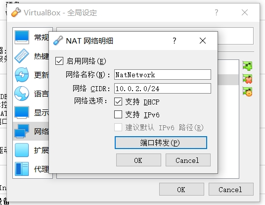
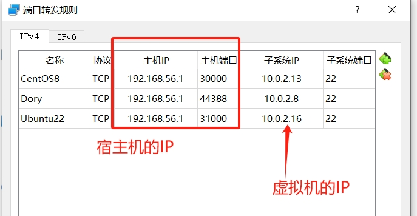
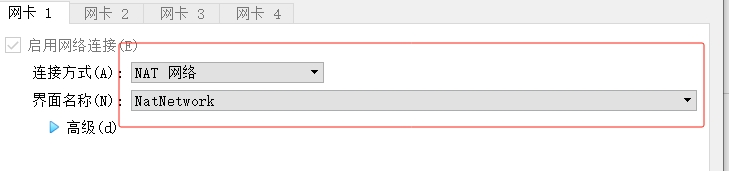

# 网络配置

## NAT 网络

1. 管理-全局设定-网络，增加一个NAT网络，启用网络并配置网络参数和名称，并配置端口转发

宿主机的某个IP并配置某个映射端口，子系统IP就是虚拟机内部的IP和某个服务的端口，比如上图的22是虚拟机的SSH端口，假设通过xshell去访问虚拟机时，需要使用宿主机的IP+映射的端口去访问。

比如`ssh 192.168.56.1:30000`就访问的是 虚拟机`10.0.2.13:22`。

2. 虚拟机的网络配置如下

虚拟机就会获得上面配置的`10.0.2.0/24`网段地址。