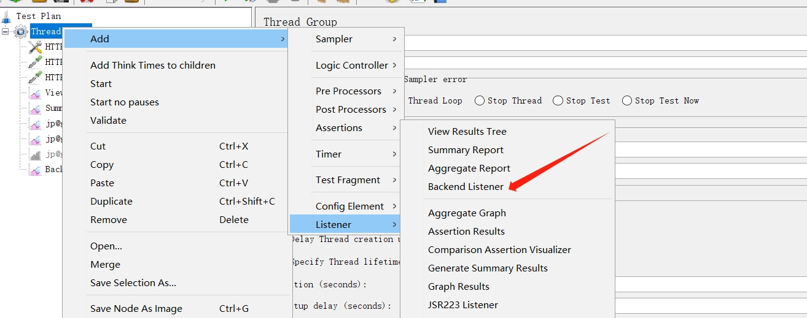
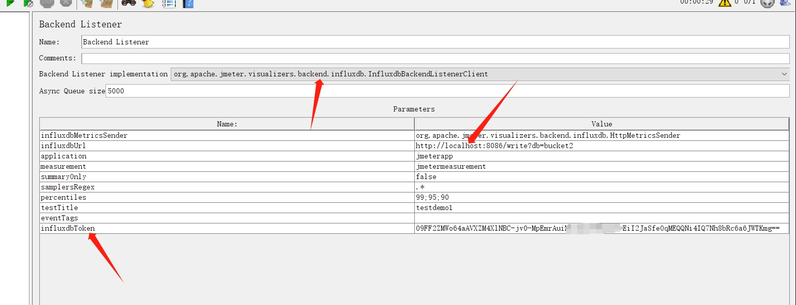

# 搭建被测服务

## 创建虚拟环境

```shell
conda create -n vjmeter python=3.12
conda activate vjmeter
pip install flask==3.0.0
```

## 创建服务代码

参考目录下`server.py`

## 部署服务

```shell
conda create -n vjmeter python=3.12
conda activate vjmeter
pip install gunicorn

# -w 建议配置为cpu+1
gunicorn -w 13 -b 127.0.0.1:8000 server1:app
```

# 开发脚本

> Jmeter从3.1开始使用groovy作为默认的脚本，且内置了groovy引擎

## demo脚本参考目录下jmx文件

## 基本脚本

```groovy
// 设置和获取props属性，props可以跨线程组使用
// vars.get vars.put类似，但是仅限于线程组内
props.put("salt", "123");
props.get("salt");
vars.put("salt", "123");
vars.get("salt");


// 获取当前时间戳
System.currentTimeMillis();


// 获取请求路径
sampler.getPath().toString();
// 获取请求全部请求路径
sampler.getUrl()
// 获取请求体内容
sampler.getArguments().getArgument(0).getValue();
// 获取查询参数
sampler.getQueryString()
```

## 请求头处理

```groovy
import org.apache.jmeter.protocol.http.control.HeaderManager;
import org.apache.jmeter.protocol.http.control.Header;
import org.apache.commons.codec.digest.DigestUtils;

// md5加密示例(注意，一般此类加密，请求体内容需要写成字符串形式，不要写成json格式，否则某些换行和空格无法处理)
// 比如在body data里面输入 {"account": "ystest_auto_user1", "accountType": "inter", "email": "test@test.cn"}
String x_sn = "/api/user" + reqBody + x_t + x_st;
x_sn = DigestUtils.md5Hex(x_sn);

// 请求头处理
HeaderManager headers = sampler.getHeaderManager();
if (headers == null) {
	  headers = new HeaderManager();
}
if (headers.size() > 0) {
	  headers.clear();
}
headers.add(new Header("x-t", x_t));
headers.add(new Header("x-st", x_st));
headers.add(new Header("x-sn", x_sn));
headers.add(new Header("Content-Type", "application/json"));
sampler.setHeaderManager(headers);
```

## 随机字符

```groovy
// 随机字符
import org.apache.commons.lang3.RandomStringUtils

// 中文
def chinese = RandomStringUtils.random(5, 0x4e00, 0x9fa5, false, false);
println chinese

// 随机字符，不包含数字
def english = RandomStringUtils.randomAlphabetic(10)
println english

// 随机字符，包含数字
String charset = (('A'..'Z') + ('0'..'9') + ('a'..'z')).join();
String randomString = RandomStringUtils.random(10, charset.toCharArray());
println randomString

// 随机字符，包含数字
def randomString2 = RandomStringUtils.random(10, true, true)
println randomString2Locust
```

## 写自己的插件

写好自己的java代码，参考`MyPlugin1.java`，根据下面方式编译出jar包

```shell
javac MyPlugin1.java
# 注意创建自己的MF文件
jar cvmf MANIFEST.MF MyPlugin1.jar MyPlugin1.class

java -jar MyPlugin1.jar
```

把java包放置到jmeter的`lib\ext`目录下，重启jmeter，在groovy脚本里面可以通过以下方式引用:

```groovy
import MyPlugin1;

// 查看打印效果
log.info("===================" + MyPlugin1.add(1, 2));
```

# 命令行参数

```shell
${__P(threadNumber, 100)}
${__P(duration, 30)}

jmeter -n -t demo1.jmx -l demo1.jtl
jmeter -JthreadNumber=10 -Jduration=300 -n -t demo1.jmx -l demo1.jtl 


-n：以非 GUI 模式运行 JMeter。
-t：指定要运行的 JMX 文件的路径。
-l：指定结果文件的路径。比如xxx.jtl日志

-j：指定 JMeter 日志文件的路径 比如jmeter.log日志
-r：以分布式模式运行 JMeter。
-D：定义系统属性。
-G：定义全局属性。
-H：指定代理服务器的主机名或 IP 地址。
-P：指定代理服务器的端口号。
-s：从结果文件中生成 HTML 报告。

-e：在测试运行后生成 HTML 报告。使用-e必须指定-l
-o //指定-e生成报告路径，会自动创建，即-e -o一般配合使用，并且必须指定-l参数
-f //强制删除日志文件，如果不指定，指定目录下如果不为空，则无法执行，注意不要指定为脚本路径，否则会把脚本文件也强制删除，删除的是-o指定的目录下的内容，不会删除-o目录
-g //指定jtl文件，一般配合-o参数使用，把jtl的日志转换为html格式的报告


# -J参数是用来设置JMeter属性的命令行参数。可以使用该参数将属性值传递给JMeter，并在测试执行期间使用这些属性。
# 该参数的语法为：-J[propertyName]=[value]
# 其中，[propertyName]是属性名，[value]是属性值。
# 例如，要将线程数设置为1000，可以使用以下命令：
jmeter -Jthreads=1000 -n -t test.jmx
# 在JMX文件中，可以使用${__P(propertyName)}函数来引用属性值。
# 例如，在Thread Group中将线程数设置为属性threads的值，可以使用以下方式：
# Number of Threads: ${__P(threads)}
```

## 分布式执行

# 插件管理

https://jmeter-plugins.org/install/Install/

`jmeter-plugins-manager.jar`包下载后放到jmeter安装目录下的`lib\ext`目录下重启jmeter即可

> 一些常用的插件

```shell
Basic Graphs   -> 基本图形插件
Additional Graphs -> 额外图形插件
PerfMon (Servers Performance Monitoring) -> 服务器资源监控插件(CPU Memory等) ，服务端需要下载额外的包: https://github.com/undera/perfmon-agent   
```

# 高级用法

## cookie自动映射变量

修改`bin/jmeter.properties`配置文件

```ini
# CookieManager behaviour - should Cookies be stored as variables?
# Default is false
; 把下面的配置改为true，就可以自动把cookie映射为变量
CookieManager.save.cookies=true

; 下面是变量的前缀，默认是COOKIE_
; 比如某个请求的响应头: Set-Cookie: VS=86e11953-8a32-4c50-9b95-5f6fbd4a06c8，那么会产生一个COOKIE_VS的变量
; 可以有多个，在脚本里面就可以通过${COOKIE_VS}获取这个变量的值
# CookieManager behaviour - prefix to add to cookie name before storing it as a variable
# Default is COOKIE_; to remove the prefix, define it as one or more spaces
# CookieManager.name.prefix=
```

## jtl查看具体请求数据

> 注意一般不要这样修改，会影响实际性能(调试时可以打开，正式执行一般需要关闭)

```ini
#修改user.properties
jmeter.save.saveservice.output_format=xml
jmeter.save.saveservice.response_data=true
jmeter.save.saveservice.samplerData=true
jmeter.save.saveservice.requestHeaders=true
jmeter.save.saveservice.url=true
jmeter.save.saveservice.responseHeaders=true

#修改jmeter.properties
jmeter.save.saveservice.response_data=true
jmeter.save.saveservice.samplerData=true
```

## 输出数据到influxdb

> 参考文章: https://blog.csdn.net/Androidyuexia/article/details/131206489

```shell
docker pull influxdb

docker run -p 8086:8086 influxdb
# 启动服务后，浏览器打开访问: localhost:8086，基础配置完成后即可

docker run -p 8086:8086 -v myInfluxVolume:/var/lib/influxdb2 influxdb

docker run --rm influxdb:2.0 influxd print-config > config.yml
docker run -p 8086:8086 -v $PWD/config.yml:/etc/influxdb2/config.yml influxdb:2.0
```

jmeter配置如下:



> 注意本文的influxdb是基于2版本以上的，故配置和1会有不同，其中url后面db就是influxdb里面bucket的意思，注意增加apitoken



# 参考链接

1. [log vars props...](https://jmeter.apache.org/usermanual/functions.html#__javaScript)
2. [api](https://jmeter.apache.org/api/index.html)
3. [](https://jmeter.apache.org/usermanual/functions.html)


